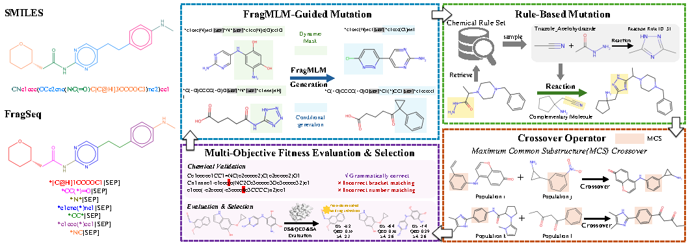

# FragEvo: A Molecular Language Model Driven Genetic Algorithm for Multi-Objective Molecular Generation

We introduce FragEvo, an evolutionary algorithm framework guided by a fragment-based language model (FragMLM).

In our model, consisting of four main modules:

(1) FragMLM-Guided Mutation — semantic, fragment-level edits proposed by FragMLM; 

(2) Rule-Based Mutation — chemically valid transformations via documented reaction rules; 

(3) Crossover Operator — recombination by exchanging molecular substructures; 

(4) Multi-Objective Fitness Evaluation & Selection — multi-criterion assessment and selection to discard invalid molecules and drive iterative population optimization.



*Left: A comparison of SMILES and FragSeq representations of the same molecule. Right: Overview of FragEvo. The pipeline comprises four components.*

---

## Installation

### environment
The required environmental dependencies for this project are listed in the  `fragevo.yml` file. You can easily create and activate the environment using Conda:
```bash
conda env create -f fragevo.yml
conda activate fragevo
```
#### Docking toolchain
- MGLTools:([MGLTools downloads](https://ccsb.scripps.edu/mgltools/downloads/))
```bash
tar -zxvf <mgltools-*.tar.gz>
cd mgltools_x86_64Linux2_1.5.6
./install.sh
cd ..
```
- AutoDock Vina ([autodock vina downloads](https://autodock-vina.readthedocs.io/en/latest/index.html/))/ QVina2 ([qvina2downloads](https://openbabel.org/docs/Installation/install.html#))
```bash
chmod +x your/path/to/autodock_vina_1_1_2_linux_x86/bin/vina
```
- OpenBabel (installed via Conda)
### FragMLM pre-trained weighted

## Usage
### Test
```bash
python FragEvo_main.py --config fragevo/config_fragevo.json --receptor parp1 --output_dir output
```
### Comprehensive Performance Evaluation and Comparative Analysis

```bash
python FragEvo_main.py --config fragevo/config_fragevo.json --all_receptor parp1 --output_dir output_all
```
#### 1) Single objective
To set : ./fragevo/congfig_fragevo.json/ "selection_mode": "single_objective";
#### 2) Multi-objectives 
To set : ./fragevo/congfig_fragevo.json/ "selection_mode": "multi_objective".

### Benchmark Against Genetic and Learning-Based Baselines
#### CompScore 
```bash
python FragEvo_rag.py --config fragevo/config_fragevo_rag.json --receptor parp1 --output_dir FragEvo_output_rag
```

## Reproduction tips (recommended)

1) **Start with a small smoke test**: reduce `max_generations`, `number_of_crossovers`, `number_of_mutants`, and `n_select` to validate the full chain (generation → docking → selection → reporting).
2) **Docking is the slowest stage**: for fast validation, reduce `docking_exhaustiveness` and `docking_num_modes`.
3) **Parallelism**
   - Across receptors: `performance.parallel_processing` + `performance.max_workers`
   - Within a receptor (docking etc.): `performance.number_of_processors` (`-1` means auto)

